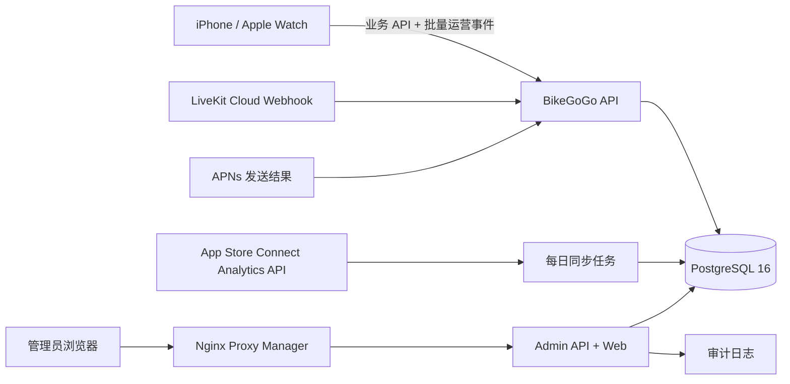

# BikeGoGo 运营管理后台设计

> 第一阶段已落地：`admin/` 提供独立管理 API 和静态后台界面，生产镜像为
> `bikegogogo-admin`。为减少 NAS 组件数量，第一阶段由同一容器提供 Web 与 Admin API；
> 权限、会话、审计和数据边界仍与业务 API 独立。部署见
> [ADMIN_DEPLOYMENT.md](ADMIN_DEPLOYMENT.md)。

## 1. 建设目标

BikeGoGo 已经进入正式运营阶段。管理后台的目标不是简单展示数据库记录，而是建立一套
能够回答以下问题的运营与质量系统：

- 有多少人下载、注册、活跃和留存？
- 用户是否顺利完成首次骑行、Apple Watch 联动和云同步？
- 每天产生多少次骑行、多少距离、多少有效骑行时长？
- 好友、小队和语音功能是否真正被使用，在哪一步流失？
- App、接口、APNs、LiveKit 和云同步是否稳定？
- 某个用户反馈问题时，客服能否在不暴露敏感信息的情况下快速定位？
- 哪个版本或系统版本的错误明显增多？

后台采用“聚合运营默认可见、个人敏感数据按需授权、所有管理操作留痕”的原则。

## 2. 当前系统现状

当前服务端已经保存以下业务数据：

- 用户、访客账户与 Sign in with Apple 绑定关系；
- 会话、好友申请、好友关系、小队和成员；
- 骑行记录、统计指标、天气和完整轨迹点；
- APNs token、语音邀请；
- 90 秒自动过期的小队实时位置和集合点。

但现阶段存在以下可观测性缺口：

- PostgreSQL 主要使用 `bikegogogo_app_state.payload` 单行 JSONB 保存业务状态，不适合
  直接进行长期统计和多维查询；
- 没有客户端运营事件，无法准确计算 DAU、漏斗和留存；
- APNs 结果和 API 错误主要存在进程日志中，没有可查询的历史统计；
- LiveKit token 签发不等于实际进入房间，无法判断真实语音成功率和使用时长；
- MetricKit 报告目前只保存在用户设备，不会自动上传；
- 没有管理员账户、权限、审计日志和后台 API。

因此，后台不能只读取当前 JSONB 数据。需要保留现有业务存储稳定性的同时，新增独立的
运营事件和聚合数据层。

## 3. 总体架构



### 推荐服务拆分

- `bikegogogo-server`：继续负责 App 业务接口，并接收运营事件；
- `bikegogogo-admin`：独立 Fastify 进程，提供后台查询、受控管理操作和同源静态管理界面；
- `postgres:16`：复用现有数据库，新增独立表，不引入新的必需中间件；
- 可选 `prometheus + grafana`：仅用于工程监控，不替代产品运营后台；
- 可选 `loki`：当 NAS 日志量增加后再接入。

管理后台只通过独立域名暴露，例如 `bikegogogo-admin.sssnto.cn`。PostgreSQL、Admin API
和 Prometheus 均不直接映射到公网。

## 4. 后台信息架构

### 4.1 总览

首屏只展示最重要的趋势和异常：

- 今日、昨日、近 7 日、近 30 日注册用户；
- DAU、WAU、MAU 和 DAU/MAU；
- 今日骑行次数、完成率、总距离、总时长；
- 首次骑行激活率；
- Apple Watch 骑行占比、健康数据覆盖率；
- 语音邀请数、接通率、平均语音时长；
- 云同步成功率、API 错误率、推送成功率；
- 当前版本占比、需要升级的旧版本占比；
- 最近 24 小时高优先级异常。

所有数字支持与上一周期对比，并可切换 `今天 / 7 天 / 30 天 / 自定义`。

### 4.2 增长与留存

- App Store 展示、产品页访问、首次下载、重新下载、转化率；
- 新增访客账户、Apple 登录账户、访客绑定 Apple 的转化；
- DAU、WAU、MAU；
- D1、D7、D30 留存；
- 新用户激活漏斗：
  `下载 -> 首次打开 -> 建立账户 -> 授权定位 -> 连接 Watch -> 开始骑行 -> 完成骑行 -> 云同步`；
- 按 App 版本、iOS 版本、设备类别、地区进行聚合筛选。

App Store 下载与展示数据应通过 App Store Connect Analytics Reports API 每日同步，
不能从业务数据库准确推算。首个持续报告通常需要等待 Apple 生成，后台展示时标明数据
更新时间和 Apple 的隐私阈值限制。

### 4.3 骑行运营

- 骑行开始数、完成数和异常中断数；
- 骑行完成率、自动暂停触发率、恢复率；
- 总里程、总移动时长、平均单次里程和时长；
- iPhone、Apple Watch、合并记录的来源占比；
- HealthKit 导入成功率、轨迹覆盖率、心率覆盖率、天气覆盖率；
- 云同步成功率、失败原因和待同步数量；
- 分享作品生成率、模板使用分布；
- 骑行距离区间分布，例如 `< 1 km`、`1-10 km`、`10-30 km`、`30-60 km`、`> 60 km`。

运营页不展示个人心率值或原始轨迹。健康数据只展示“是否成功采集”的聚合覆盖率，用于
改善骑行功能，不用于广告、营销或用户画像。

### 4.4 好友与小队

- 好友申请发送数、接受数、拒绝数、过期数；
- 好友申请接受率和平均响应时间；
- 新建小队数、活跃小队数、小队平均人数；
- 小队加入、退出、解散趋势；
- 位置共享开启次数、集合点使用次数、SOS 发送次数；
- 社交漏斗：
  `发送好友申请 -> 成为好友 -> 加入小队 -> 发起语音 -> 接通语音`。

SOS 仅统计次数、时间和处理状态，不在运营看板展示坐标。

### 4.5 语音质量

- 好友语音与小队语音的邀请、接受、拒绝和超时数；
- 实际加入房间人数、接通率和平均通话时长；
- 首次连接耗时、重连次数、异常断开率；
- 按 Wi-Fi / 蜂窝网络、App 版本和系统版本统计；
- 丢包、抖动、往返时延按区间聚合；
- Krisp 降噪启用率和音频路由分布；
- LiveKit 服务端 webhook 与客户端连接事件的差异告警。

后台不录音、不保存音频内容，也不展示用户说话内容。

### 4.6 推送与通知

- APNs Sandbox / Production token 数量；
- token 注册、刷新和失效趋势；
- 好友申请、小队邀请、语音邀请、SOS 等通知的发送量；
- APNs 接受率、拒绝率、无效 token 清理量；
- 按事件类型、App 版本和环境筛选；
- 推送失败原因聚合，不展示完整 device token。

### 4.7 应用质量

- API 请求量、成功率、4xx/5xx 分布；
- p50、p95、p99 响应时间；
- 云同步、Apple 登录、LiveKit token、APNs 等核心接口的错误率；
- App 启动、卡顿、崩溃、内存、能耗和磁盘写入趋势；
- App 版本、构建号、iOS/watchOS 版本、设备类型分布；
- 最近错误码、受影响用户数和首次/最后发生时间；
- 服务端版本、数据库状态和最近部署时间。

MetricKit 自动上传会改变现有隐私说明。实现前必须增加明确的诊断数据开关、更新隐私
政策和 App Store 隐私标签。第一版可以先接入服务端错误和 App Store Connect 聚合数据。

### 4.8 用户支持

支持人员可以按 BikeGoGo 用户 ID、好友码或昵称查找用户，默认展示：

- 用户 ID、昵称、好友码、注册时间、最近活跃时间；
- 访客/Apple 登录状态，但不显示 Apple subject；
- 好友数、小队数、骑行数量、最后同步时间；
- App 版本、系统版本、最近的标准化错误码；
- 账户状态和会话数量。

默认禁止显示：

- Apple 登录 subject、完整邮箱和完整 device token；
- 原始骑行轨迹、实时位置、SOS 坐标；
- 心率、热量、功率、踏频等个人健康明细；
- LiveKit 或 APNs 密钥、访问令牌。

后续如确需排障，应采用“输入工单号和原因 -> 临时解锁 -> 记录审计日志”的受控流程。

### 4.9 系统与审计

- 管理员登录、失败登录、退出；
- 数据导出、用户查询、敏感信息临时解锁；
- 会话撤销、账户停用、推送 token 清理等管理动作；
- 操作人、时间、IP、目标对象、原因和结果；
- 数据采集延迟、每日聚合任务状态和 App Store Connect 同步状态。

## 5. 核心指标口径

所有页面必须复用统一指标定义，避免同一个“活跃用户”在不同页面含义不同。

| 指标 | 口径 |
| --- | --- |
| DAU | 当天至少产生一次有效会话或核心业务事件的去重用户数 |
| WAU / MAU | 最近 7 / 30 天至少活跃一次的去重用户数 |
| 新增用户 | `users.createdAt` 落在统计周期内的用户数 |
| 激活用户 | 注册后 7 天内完成第一条有效骑行的用户 |
| 有效骑行 | 已完成且距离不小于 500 米，或移动时间不小于 10 分钟 |
| 骑行完成率 | `ride.finished / ride.started`，按同一骑行 ID 去重 |
| Watch 使用率 | 来源为 `appleWatch` 或 `merged` 的有效骑行 / 全部有效骑行 |
| 云同步成功率 | 同步成功的骑行数 / 尝试同步的骑行数 |
| 语音接通率 | 至少有一名接收方实际加入房间的邀请 / 有效邀请 |
| 推送成功率 | APNs 接受的 token 数 / 实际提交的 token 数 |
| D7 留存 | 某日新增用户中，第 7 天再次活跃的用户比例 |

“有效骑行”的阈值做成服务端配置，但调整后必须记录版本，避免历史统计口径无声变化。

## 6. 运营事件模型

### 6.1 事件来源

- 服务端权威事件：注册、账户绑定/删除、好友、小队、骑行上传、推送发送；
- 客户端体验事件：权限结果、骑行开始/暂停/结束、Watch 联动、同步结果、分享生成；
- LiveKit webhook：参与者实际进入和离开房间；
- App Store Connect：下载、展示、商店转化、会话、崩溃等 Apple 聚合数据；
- MetricKit：在用户知情并允许后上传的设备性能和诊断报告。

服务端已经能够确认的业务事件不得仅依赖客户端上报，避免重复和伪造。

### 6.2 第一批事件

```text
app.session_started
auth.guest_created
auth.apple_signed_in
auth.guest_bound_to_apple
account.deleted

permission.location_result
permission.health_result
permission.microphone_result
permission.notification_result

ride.started
ride.auto_paused
ride.resumed
ride.finished
ride.discarded
ride.health_import_succeeded
ride.health_import_failed
ride.sync_succeeded
ride.sync_failed
ride.share_generated

watch.connected
watch.workout_started
watch.workout_failed
watch.workout_finished

friend.request_sent
friend.request_accepted
friend.request_rejected
group.created
group.member_joined
group.member_left
group.location_share_started
group.sos_sent

voice.invitation_sent
voice.invitation_accepted
voice.invitation_rejected
voice.invitation_expired
voice.room_connected
voice.room_disconnected
voice.reconnected

push.token_registered
push.send_accepted
push.send_rejected
```

### 6.3 事件公共字段

```json
{
  "eventId": "UUID",
  "eventName": "ride.finished",
  "occurredAt": "ISO-8601",
  "sessionId": "UUID",
  "appVersion": "1.0",
  "buildNumber": "32",
  "platform": "iOS",
  "osVersion": "26.4",
  "deviceFamily": "iPhone",
  "properties": {
    "source": "merged",
    "distanceBucket": "30_60_km"
  }
}
```

事件中禁止包含经纬度、原始健康值、邮箱、姓名、Apple subject、访问令牌、APNs token
和自由文本错误堆栈。错误使用有限枚举的 `errorCode`。

客户端通过 `POST /v1/telemetry/events` 批量上传，单批最多 100 条，服务端按 `eventId`
幂等去重。网络不可用时本机最多保留 500 条，按先进先出清理。

## 7. 数据表设计

现有 `bikegogogo_app_state` 暂不迁移，先增加以下表，降低对线上核心业务的改动风险。

### 7.1 运营事件

```sql
CREATE TABLE analytics_events (
  event_id UUID PRIMARY KEY,
  event_name TEXT NOT NULL,
  occurred_at TIMESTAMPTZ NOT NULL,
  received_at TIMESTAMPTZ NOT NULL DEFAULT NOW(),
  user_key TEXT,
  session_id UUID,
  app_version TEXT,
  build_number TEXT,
  platform TEXT NOT NULL,
  os_version TEXT,
  device_family TEXT,
  properties JSONB NOT NULL DEFAULT '{}'::jsonb
);

CREATE INDEX analytics_events_occurred_idx
  ON analytics_events (occurred_at DESC);
CREATE INDEX analytics_events_name_time_idx
  ON analytics_events (event_name, occurred_at DESC);
CREATE INDEX analytics_events_user_time_idx
  ON analytics_events (user_key, occurred_at DESC);
```

`user_key` 使用服务端密钥对业务用户 ID 做 HMAC，不把用户 ID 直接写入通用运营事件表。

### 7.2 聚合与同步

- `analytics_daily_metrics`：每日核心指标和维度聚合；
- `analytics_funnel_daily`：漏斗步骤和人数；
- `app_store_report_requests`：Apple 报告请求及游标；
- `app_store_daily_metrics`：展示、下载、转化、会话、崩溃等 Apple 聚合数据；
- `voice_sessions`：房间级时长和质量摘要，不含音频；
- `push_delivery_daily`：按环境、事件类型和结果聚合；
- `system_incidents`：后台可见的异常和恢复状态。

### 7.3 管理与审计

- `admin_users`：管理员、密码摘要、TOTP 状态、角色和禁用状态；
- `admin_sessions`：服务端会话摘要、过期时间和最后活动时间；
- `admin_audit_logs`：管理员操作的不可变审计记录；
- `admin_support_grants`：敏感数据临时授权和到期时间。

## 8. 管理员权限

| 角色 | 权限 |
| --- | --- |
| `viewer` | 查看聚合运营和质量指标 |
| `operator` | 查看用户支持摘要、重新触发安全的后台任务 |
| `support` | 按工单查看单用户故障摘要，不能看原始健康和位置 |
| `admin` | 管理管理员、撤销会话、停用账户、查看审计日志 |

第一版只开放 `viewer` 和 `admin`，并且除管理员账户管理外保持业务只读。账户删除、原始
数据导出和批量操作不放入第一版。

### 登录安全要求

- 管理员密码使用 Argon2id；
- 强制 TOTP 二次验证；
- Cookie 使用 `HttpOnly + Secure + SameSite=Strict`；
- 30 分钟无操作过期，最长 8 小时；
- 登录失败限速和短时锁定；
- 所有状态修改使用 CSRF token；
- Nginx Proxy Manager 再配置 Access List 或固定 IP/VPN，形成两层保护；
- 不允许通过 App 用户的 Sign in with Apple 直接获得后台权限。

## 9. 隐私、合规与保留期限

- 运营后台不用于广告定向，也不根据 HealthKit 数据建立营销画像；
- 精确位置和健康明细不进入通用运营事件；
- 运营事件默认保留 90 天，每日匿名聚合保留 25 个月；
- 管理员审计日志建议保留 1 年；
- 用户注销时删除业务数据，并解除事件与用户的可关联关系；
- 导出文件添加水印、过期时间并记录下载审计；
- 上线客户端事件和 MetricKit 上传前，更新隐私政策、App Store 隐私标签和应用内说明。

Apple 明确要求收集用户或使用数据时取得用户同意，并禁止将 HealthKit 数据用于广告、
营销或类似的数据挖掘。参考：

- [App Review Guidelines 5.1](https://developer.apple.com/app-store/review/guidelines/#privacy)
- [Protecting user privacy in HealthKit](https://developer.apple.com/documentation/healthkit/protecting-user-privacy)
- [Monitoring app performance with MetricKit](https://developer.apple.com/documentation/metrickit/monitoring-app-performance-with-metrickit)

## 10. Admin API 草案

```http
POST   /admin/api/v1/auth/login
POST   /admin/api/v1/auth/totp/verify
DELETE /admin/api/v1/auth/session

GET /admin/api/v1/overview
GET /admin/api/v1/growth
GET /admin/api/v1/retention
GET /admin/api/v1/rides
GET /admin/api/v1/social
GET /admin/api/v1/voice
GET /admin/api/v1/push
GET /admin/api/v1/quality
GET /admin/api/v1/versions

GET /admin/api/v1/users
GET /admin/api/v1/users/:userId
GET /admin/api/v1/audit-logs
GET /admin/api/v1/data-freshness
```

所有列表接口支持统一的 `from`、`to`、`timezone`、`appVersion`、`osVersion` 和分页参数。
默认时区为 `Asia/Shanghai`，数据库统一保存 UTC。

## 11. 页面视觉与交互

这是运营工具，采用安静、紧凑、便于扫描的桌面布局：

- 左侧固定导航，顶部提供日期、版本和平台筛选；
- 总览首屏使用少量 KPI，不堆叠装饰性卡片；
- 趋势优先使用折线和分组柱图，比例使用堆叠条形图；
- 表格支持排序、过滤、列配置和 CSV 导出；
- 所有指标都有口径说明、数据更新时间和异常提示；
- 颜色只表达状态：绿色正常、橙色风险、红色故障；
- 不把原始 JSON 或内部错误堆栈直接暴露给普通运营角色；
- 移动端仅支持查看总览和告警，完整操作以桌面端为主。

## 12. NAS 部署方式

MVP 不要求新增云端中间件，复用 PostgreSQL 16。Compose 最终增加：

```text
bikegogogo-admin       仅内网 8082
postgres               仅 Docker 网络 5432
```

Nginx Proxy Manager 配置：

- 域名：`bikegogogo-admin.sssnto.cn`；
- 强制 HTTPS、HTTP/2 和 HSTS；
- `/` 和 `/admin/api/` 均转发到 `bikegogogo-admin:8082`；
- 配置 Access List；
- 不缓存登录、用户和审计接口响应。

需要新增的外部配置只有两项：

1. LiveKit Cloud webhook，用来得到真实进入/离开房间事件；
2. App Store Connect API Key，建议创建最小权限的 `Sales and Reports` 读取密钥，用于
   每日同步下载和商店分析报告。Apple Analytics Reports API 支持将商店展示、下载、
   使用和性能数据接入自有后台。

## 13. 分阶段落地

### 阶段 A：只读运营 MVP

- 建立管理员登录、TOTP、权限和审计；
- 从现有业务状态生成用户、骑行、好友、小队基础统计；
- 新增运营事件表和批量事件接口；
- 完成总览、骑行、社交、用户支持摘要页面；
- 增加 APNs 和 API 错误持久化统计；
- 完成 NAS Compose 与 Nginx Proxy Manager 部署文档。

验收：管理员能看到真实线上用户、骑行和社交趋势；所有页面有数据更新时间；运营账号
无法访问健康明细、精确坐标和密钥。

### 阶段 B：完整漏斗与质量

- iOS/watchOS 接入第一批运营事件；
- 配置 LiveKit webhook；
- 接入 App Store Connect Analytics Reports；
- 完成增长、留存、语音、推送、版本和质量页面；
- 增加每日聚合任务和数据延迟告警。

验收：能计算首次骑行漏斗、D1/D7/D30、真实语音接通率、云同步成功率和版本错误率。

### 阶段 C：受控管理能力

- 会话撤销、账户停用、推送 token 清理；
- 工单原因和敏感信息临时授权；
- CSV 导出、水印、过期下载；
- 可选 Prometheus、Grafana 和 Loki；
- 将业务 JSONB 状态逐步迁移到规范化 PostgreSQL 表。

验收：所有管理操作可追溯、可回滚或二次确认，且不会因为后台查询影响 App 核心接口。

## 14. 首版范围结论

第一版建议立即实现阶段 A，不先做复杂的营销系统和远程修改用户数据。阶段 A 可以在不
迁移线上核心业务表的前提下提供可靠的用户、骑行、社交、同步和服务质量视图，为后续
事件漏斗与 App Store 数据接入打好基础。
