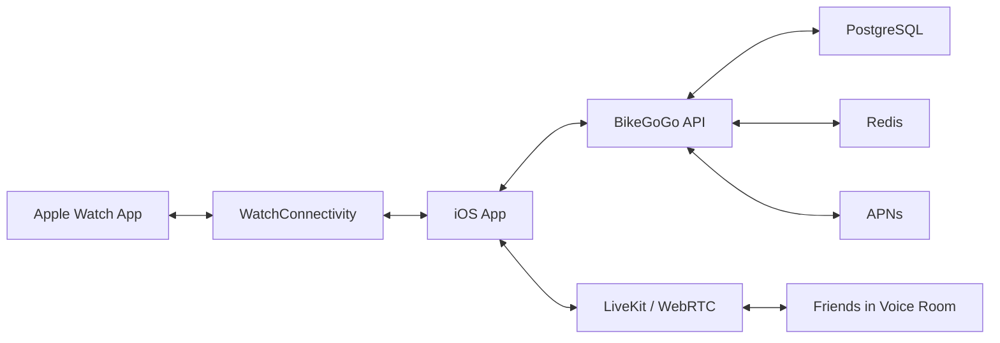

# BikeGoGo 技术设计

## 总体架构



## 客户端

### iOS

- Swift + SwiftUI。
- MapKit 展示地图和轨迹。
- CoreLocation 记录定位。
- HealthKit 读取或写入 workout 相关数据。
- WatchConnectivity 与 Watch 同步。
- AVFoundation 管理音频会话。
- 后台能力：
  - Location updates
  - Audio
  - Remote notifications

### watchOS

- SwiftUI。
- HealthKit `HKWorkoutSession`。
- `HKLiveWorkoutBuilder` 实时读取心率、距离、能量等数据。
- Workout processing 后台模式。
- WatchConnectivity 同步当前状态到 iPhone。

## 实时语音

推荐使用 LiveKit 作为 WebRTC 层，而不是自研底层音频传输。

原因：

- iOS Swift SDK 成熟。
- 支持多人房间。
- 支持断线重连。
- 支持音频 track 管理。
- 可先用 LiveKit Cloud，后续再自建。

客户端不直接保存 LiveKit 密钥，只向后端请求短期 token：

```text
iOS App -> BikeGoGo API -> LiveKit token
```

## 后端

MVP 后端建议：

- Node.js + TypeScript。
- Fastify 或 Hono。
- PostgreSQL。
- Redis。
- LiveKit Server SDK。
- APNs 推送。

主要服务：

- 用户服务。
- 好友服务。
- 骑行记录服务。
- 语音房间 token 服务。
- 设备推送服务。

## 数据同步策略

### 轨迹点

骑行中每 1-5 秒采样一次，取决于速度和电量。上传时批量发送，避免每个点都请求网络。

### Watch 数据

Watch 向 iPhone 发送关键状态：

- workout 开始/暂停/结束。
- 当前心率。
- 当前距离。
- 当前速度。
- 当前语音静音状态。

实时消息使用 `sendMessage`，后台可靠同步使用 `transferUserInfo`。

## 隐私与权限

必须清楚说明这些权限的用途：

- 位置：记录骑行轨迹。
- 后台位置：锁屏后继续记录路线。
- 麦克风：小队语音沟通。
- 蓝牙：后续连接骑行传感器。
- HealthKit 读取：读取心率、运动数据。
- HealthKit 写入：保存骑行 workout。
- 通知：好友邀请、语音房间提醒。

## MVP 代码分层

```text
BikeGoGoCore
├── Models
├── RideStatisticsCalculator
└── SampleData

iOS App
├── AppState
├── LocationRideRecorder
├── VoiceRoomClient
├── WatchSessionBridge
└── SwiftUI Views

watchOS App
├── WatchWorkoutManager
├── WatchSessionBridge
└── SwiftUI Views
```

## 风险点

- iOS 对 VoIP 和后台行为审核严格，PushKit 必须用于真实来电类场景并配合 CallKit。
- Watch 后台任务需要严格控制 CPU 和电量。
- HealthKit 必须给用户明确授权和保存/丢弃 workout 的选择。
- 实时语音质量强依赖网络，必须做断线重连和状态提示。

